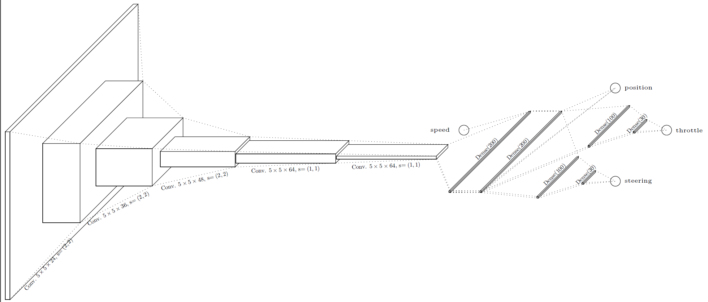

### PosNet for SRC steering

This model was able to drive around multiple turns on the thunderhill racetrack at ~25mph. The model is simliar to this one: http://www.cv-foundation.org/openaccess/content_iccv_2015/papers/Kendall_PoseNet_A_Convolutional_ICCV_2015_paper.pdf. However, the six dimensional GPS was replaced by a one dimensional value counting upwards from -1 to 1 from the start to the finish line.

## Architecture:

The network has 5 CNN layers to process images from the centre camera. The result of those layers are then flattened and concatenated with the speed input. The speed input is then processed by two dense fully connected layers with 200 neurons each. From these two layers a direct output gives the position on the track. Training the network to predict the position allows the neurons to learn the concept of position. When predicting the steering angles and throttle, it allows the network to not only have knowledge about the action it currently has to perform to stay on the track, but as well how that relates to predicting future positions on the track. At the final dense layer, which is now aware of the concept of position, a split happens to two dense networks, each of them with a 100 and 30 neurons through a dense layer, giving steering and throttle output. The outputs of the network are hereby limited using sigmoids which are shifted such that they saturate for the max and min values of each of the outputs.

See as well the sketch.pdf for a visualisation.

This allows the model to get around multiple turns. A possible impovement would be to not only predict the steering angle, but an array of future angles to allow the network to do path planning. 
 

